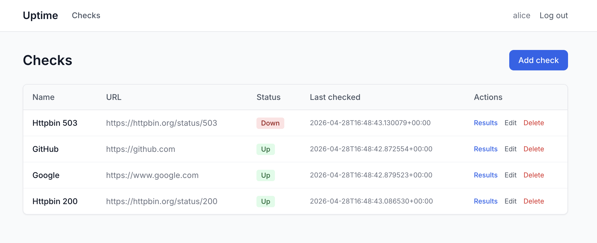
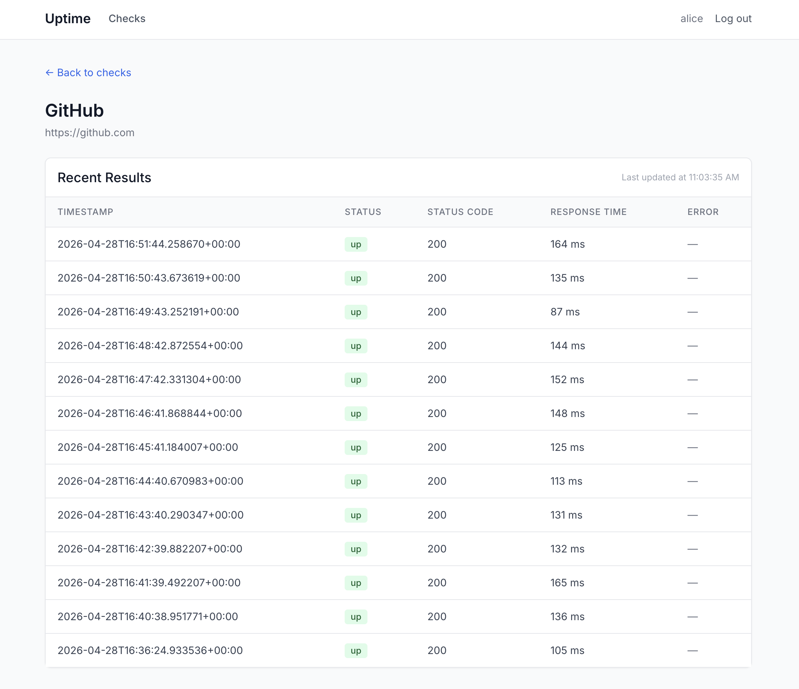

# Mayor of Three Agents

*Four hours as the lead engineer over a fleet of AI coding agents — and what actually broke.*

I spent four hours orchestrating AI coding agents into shipping a multi-tenant uptime monitoring SaaS. I didn't write the code. I didn't write the plans either. What I did: brainstormed designs with a planning agent, answered its tradeoff questions, reviewed every diff, ran the smoke tests, resolved merge conflicts, and recreated worktrees each time the base branch moved between waves.

I drove the planning agent with Jesse Vincent's [obra/superpowers](https://github.com/obra/superpowers) skill pack. Its `brainstorming → writing-plans → executing-plans` flow produces specs and plans structured enough to hand to a worker agent without a babysitter — and that turned out to matter more than the orchestration glue. The skills feed sub-agents perfectly.

This post is about the workflow, the scars I picked up running it, and the architecture calls I'd defend with or without AI in the loop.

## What got built

A small multi-tenant SaaS for HTTP uptime checks:

- A **Django dashboard** for organizations, members, and checks.
- **One AWS Lambda** that wakes up every minute on EventBridge, reads active checks from DynamoDB, runs them concurrently inside one `aiohttp.ClientSession`, and writes results back.
- **Two DynamoDB tables** — `checks` partitioned by `tenant_id`, `results` by `check_id` — with GSIs sized for the actual query patterns.

```
EventBridge ─(every 1m)─▶ Lambda ─▶ DynamoDB ◀─ Django dashboard
```

Multi-tenant from day one: every key path is scoped by `tenant_id`. No "we'll add isolation later."





## The orchestration

The setup runs on [Conductor](https://www.conductor.build/) — a Mac app that gives each agent its own git worktree on the same machine. The pattern is roughly the one [Steve Yegge has been describing](https://steve-yegge.medium.com/welcome-to-gas-town-4f25ee16dd04): one lead steering and reviewing, a fleet of agents typing. I called the lead role the "mayor."

Three plans came out of three brainstorm sessions:

| Sub-project | Tasks | Plan | Scope |
|---|---|---|---|
| `1-uptime-monitoring` | 15 | 371 lines | Bootstrap, Django, DynamoDB, Lambda, local runner |
| `2-ui-landing` | 8 | 178 lines | Tailwind base, auth, checks/results UI, landing |
| `3-security` | 5 | 256 lines | Open redirect, `SECRET_KEY` guard, `ALLOWED_HOSTS`, Lambda timeout clamp |

Each independent subtask got its own worktree — over a dozen by the end. The payoff isn't just parallelism; it's **auditability**. Every worktree was committed separately, and the Conductor UI lets me click into each agent and replay exactly what it did. If a diff looks wrong, I can see whether the agent reasoned about the call or guessed.

## Parallelism has a serial prelude

The temptation is to fan out fast. You can't dispatch parallel agents at infrastructure that doesn't exist yet.

**The mayor wrote prompts that referenced infrastructure that didn't exist.** Wave 2 prompts mentioned `compose.yml` and `PORT_OFFSET` before either was on disk. I caught it by reading one prompt against the actual repo before dispatching. Three workers in parallel all hitting "what compose file?" is a worse failure than admitting the work is serial.

**There was no hello-world Django yet.** Several of the "parallel" tasks quietly assumed a Django project that no one was actually creating — a hidden serial dependency dressed as parallelism. Someone has to scaffold the framework first; until that lands, fan-out is fiction.

**The mayor made silent tooling choices.** I noticed a stray `uptime.egg-info/` and discovered the mayor had defaulted to `pip` because it's "ubiquitous." I asked twice why pip was involved before switching to `uv` — and `egg-info` regenerated even after the switch. Mayors quietly bake in opinionated defaults; review the foundation before agents fan out.

Wave 1 is unglamorous and unavoidable. Boilerplate, compose, base Django, package manager — I conducted the mayor through these serially, no workers, until the substrate was solid enough that fan-out wouldn't fall through the floor.

## Worktrees are a coordination problem in disguise

The "look how parallel my agents are" demo skips this part. None of these are tool bugs — they're first-time-with-this-pattern gotchas, and each cost me real minutes:

- **The dev stack has to run side-by-side, or the rest is theater.** Three agents in three worktrees only works if their Django dev servers, DynamoDB Local instances, and ports don't collide. I threaded `PORT_OFFSET` through the dev stack and pinned every endpoint to env vars *before* the first fan-out. Without it, "parallel agents" turns into agents fighting over port 8000. This was the load-bearing realization that made the rest of the pattern possible.
- **Worktrees branched off `main` *before* Wave 1 was merged.** The three workspaces had almost nothing to work from. Fix: merge Wave 1 to main first, *then* recreate worktrees. Conductor worktrees snapshot at creation time; sequence matters.
- **`.context/` is per-workspace and gitignored.** The prompts the mayor "saved" lived in its own worktree, invisible to the worker worktrees. I copy-pasted prompts into each Conductor chat by hand. I was learning the mayor pattern in Conductor as I went; I haven't landed on the perfect workflow yet, but this friction tax is solvable — I just hadn't solved it on this run.
- **Repeated fast-forwards between waves** to land worktrees on the right commit. Friction tax of the pattern.
- **Two workers both edited `urls.py` and `settings.py`.** Even with careful partitioning, Django's registration files are a chokepoint. Hand-resolved. Identify shared-edit files upfront and either serialize them or pre-stub.
- **One worker crashed mid-wave.** Agent C's worktree failed; the mayor did the work itself. Agents hang, crash, or produce nothing — plan for it.
- **Style drift across agents.** The checks service uses `boto3.resource`; the Lambda handler uses `boto3.client`. Not a bug — the real cost of agents working in isolation. No one is the style cop unless I am.

## Decisions I steered, not typed

Two calls I'd defend in any architecture review:

**1. Single Lambda + asyncio over per-check fanout.** The "scalable" reflex would be a dispatcher Lambda firing N invoker Lambdas. I picked one Lambda that runs all active checks concurrently inside a single `aiohttp.ClientSession`. Dramatically less infrastructure — one EventBridge rule, one IAM role, one cold start — and aiohttp gives you thousands of in-flight requests inside a single function.

**2. `tenant_id` in DynamoDB partition keys and GSIs from day 1.** `checks` is partitioned by `tenant_id`. The active-checks GSI is `is_active` + `tenant_id`. The results-by-tenant GSI is `tenant_id` + `timestamp`. Every dashboard read is `Query`, not `Scan`. Multi-tenant isolation is much harder to retrofit than to bake in.

## Takeaway

This pattern works, and it works really well. Yes, there's a coordination tax that falls on the lead — spotting fictional prompts, recreating worktrees in the right order, hand-resolving merges in registration files no one knew were shared and some of these can be ironed out with a better workflow. Four hours of mayoring produced what would have taken me a week to type alone. This is genuinely amazing, and I'd be surprised if it isn't standard practice within a year.

The calls that actually shape the system — *which* Lambda pattern, *when* to be multi-tenant, *how* to keep three agents from colliding on the same laptop — are the same ones that mattered before AI. What changes is throughput: three of them get executed and arrive for review at roughly the same time, *if* you've done the serial prelude and can read a diff fast enough to keep up.
